

  

    
The most of my working experiences are in web development.

    
My first job was to drive Java SE with MS SQL Server to customize a web-based PTC Windchill PLM system features, and use Javascript to customize PTC Arbortext document software automations for one year and half.

    
After the first career, I started to work in Firefox OS apps and other web apps development based on HTML5 like cloud drive and restaurant search system. Currently my main job is to plan and provide the restaurant search app's backend REST services. Backend structure consists of PHP Codeigniter with MySQL.

    
Aside from the main backend development job, I personally prefer front-end development, so I follow the trends of web technology, individually I study some of front-end tools and frameworks like nodejs, angularjs and react.

    
My characteristics are well-organized, work efficiently and high self-demanded to productivities in which the tasks responsible for.
  

  

    <h3>Work</h3>
    <ul class="list-group">
      <li class="list-group-item">
        <h4>Simple Blog System - built by PHP with Smarty and MySQL</h4>
        <a target="add" href="http://hoyang.myds.me/uni-project/php-blog">http://hoyang.myds.me/uni-project/php-blog</a>
      </li>
       
      <li class="list-group-item">
        <h4>Social Hub - built by pure javascript with Material Design Lite</h4>
        <a target="add" href="https://chrome.google.com/webstore/detail/social-hub/ghbmmfdmaegmffeogibdgaijaelfaijm">https://chrome.google.com/webstore/detail/social-hub/ghbmmfdmaegmffeogibdgaijaelfaijm</a>
      </li>
       
      <li class="list-group-item">
        <h4>IM Hub - built by React with Material UI</h4>
        Support most of popular chatting web applications like Messenger, Hangouts, Telegram, Skype, Whatsapp and WeChat. Let you switch between different IM apps instantly.
        <a target="add" href="https://chrome.google.com/webstore/detail/im-hub/hbmefbfbophhojlhbgbonngkehnacnke">https://chrome.google.com/webstore/detail/im-hub/hbmefbfbophhojlhbgbonngkehnacnke</a>
      </li>
    </ul>
  

  

    <h3>Projects</h3>
    <h4>FireFox OS Web App - Clock</h4>
    

      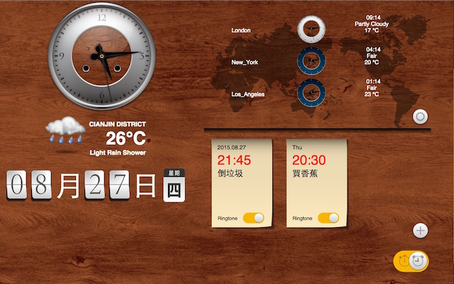
      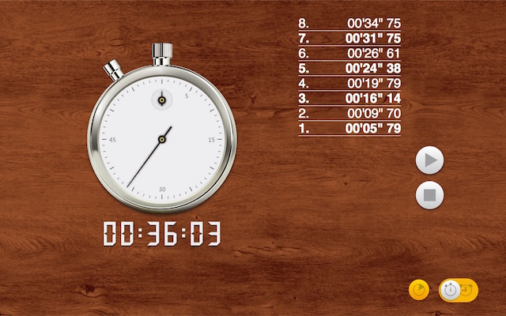
      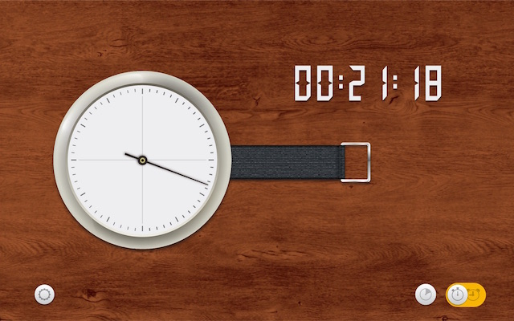
    

    <h4>Cloud Drive Web</h4>
    

      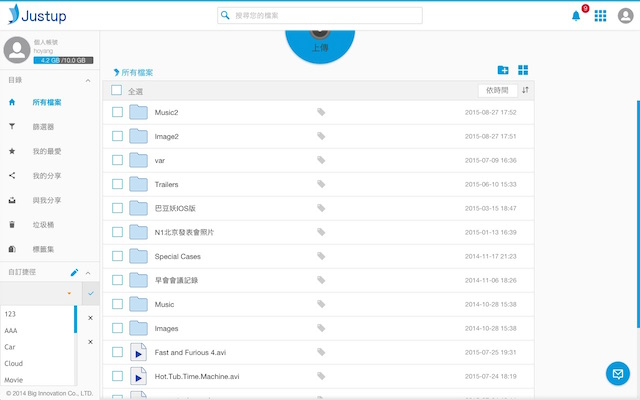
      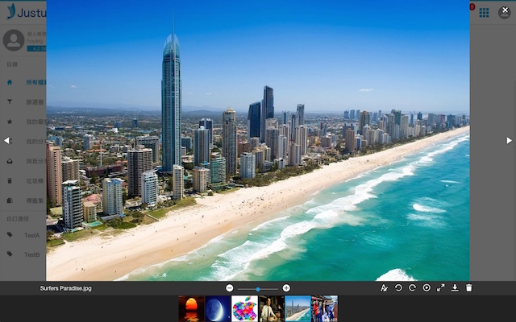
      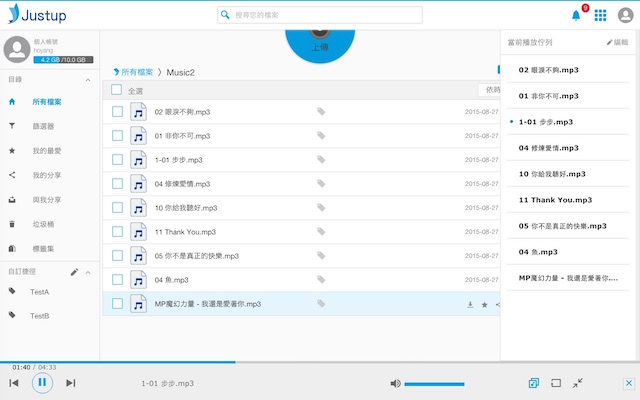
      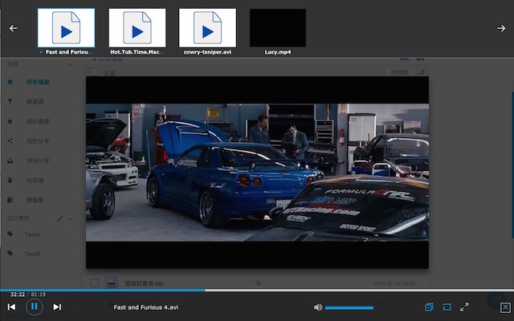
    

    <h4>Restaurant Search</h4>
    

      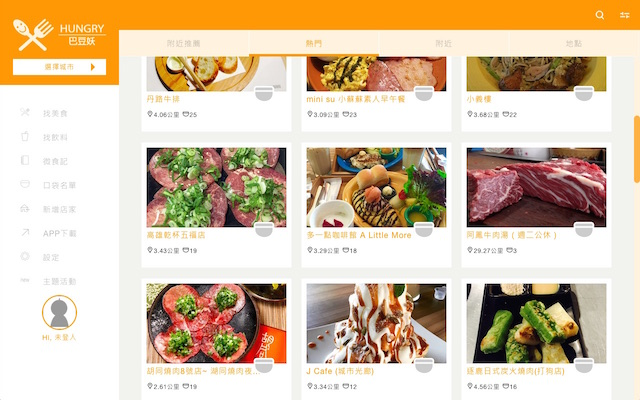
      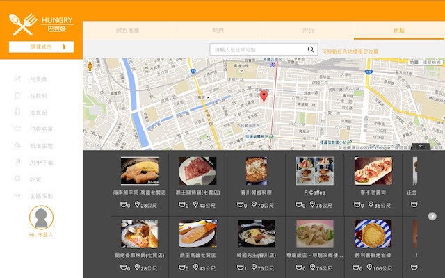
      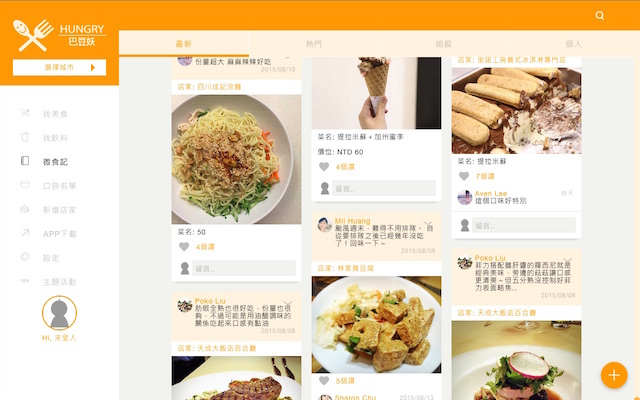
      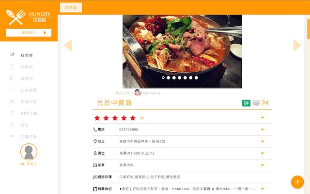
      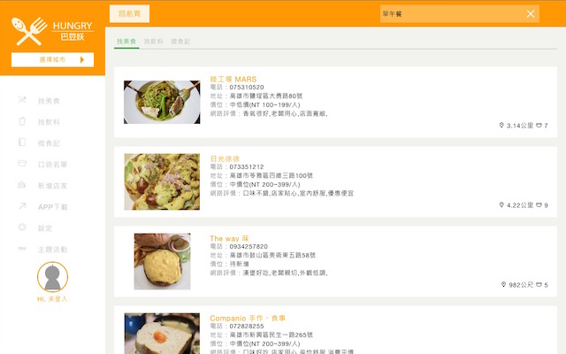
    

  

