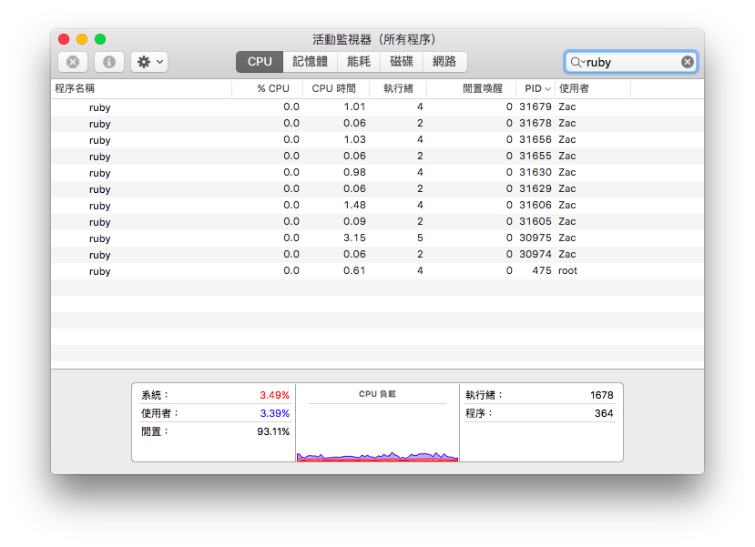

[GitHub](https://github.com/) 原本就支援使用 [Jekyll](http://jekyllrb.com/) 建置網站，無需上傳 Jekyll 開發過程所產生的靜態網頁，只要在本地端將網站開發完成，將設定檔、sass 樣式表和一些 HTML 的模版上傳到 GitHub repository 就會自動編譯產生靜態網頁內容。

<!-- more -->

## 環境建置

如果要在本地端開發 Jekyll 架構的網站，首先要有 ruby 環境<br>
Mac OS 本身已有 ruby 環境，只需要確認 ruby 版本為 2.0 以上<br>
可用 `ruby -v` 指令檢查目前 ruby 版本<br>
之後用 ruby 的 gem 安裝 jekyll `gem install jekyll`<br>
接下來就可以用 jekyll 指令 `jekyll new my-site`，簡單地新增一個網站。<br>
`cd my-site` 目錄下打 `jekyll serve`<br>
前往 `http://127.0.0.1:4000/` 看到目前網站的畫面

## 比 gem 更好用的套件管理工具

因為 gem 沒有像 nodejs 的 npm 一樣，可透過 `npm init` 指令自動建立一個 package.json 套件清單的檔案。<br>
我改用 ruby 另一個套件管理工具 [bundler](http://bundler.io/) 讓我可以方便管理 ruby 安裝的套件。<br>

一樣先用 gem 安裝 bundler `gem install bundler` <br>
再到 my-site 根目錄下打 `bundle init` 就會自動建立一個 Gemfile 套件清單的檔案<br>
之後安裝套件只要在 Gemfile 下面加一行 `gem [gemname]` 來安裝套件<br>

```ruby
# A sample Gemfile
source "https://rubygems.org"

gem 'kramdown'
```

## Jekyll x Livereload 快速開發

透過 `jekyll serve -w` 指令，Jekyll 本身就支援 web hosting 和監看檔案變更，即時編譯新的網頁內容

但是因為先前有用 Google Chrome 的 [livereload](https://chrome.google.com/webstore/detail/livereload/jnihajbhpnppcggbcgedagnkighmdlei) 搭配 gulp 開發網頁的流暢經驗

所以我找到 ruby 另外一個 [guard](http://guardgem.org/) 的工具

guard 同時支援 jekyll 和 livereload 這兩個功能

先在 Gemfile 裡面加入這三個主要的套件：

```ruby
gem 'guard'
gem 'guard-jekyll-plus'
gem 'guard-livereload'
```

再執行 `bundle install` 就會把它所有的 dependencies 一起安裝進來

然後在 my-site 根目錄底下新增一個 Guardfile

```ruby:title=guardfile
guard 'jekyll-plus', :serve => true do
  watch /.*/
  ignore /^_site/
end

guard 'livereload' do
  watch /.*/
end
```

之後不再使用 jekyll 指令，改打 `guard` 或 `bundle exec guard` 就可以監看檔案變更同時，自動重新整理背後的瀏覽器網頁

## 增加網頁圖示

因為 `jekyll new my-site` 預設只提供 github 和 twitter 兩個 svg 圖示<br>
後來我在 _includes/head.html 裡面增加 [font-awesome](https://fortawesome.github.io/Font-Awesome/) 的 CSS

```html
<link rel="stylesheet" href="https://maxcdn.bootstrapcdn.com/font-awesome/4.4.0/css/font-awesome.min.css">
```

之後就有很多免費的 icon fonts 可以使用了

## 附註

一般使用 Jekyll 進行開發，執行 `jekyll serve` 等指令，中途要停止只要按 ctrl + c

但是如果用 guard 進行開發，按 ctrl + c 不會終止程序，只會不斷印 `[1] guard(main)>`

這時候會試著按 ctrl + z 終止程序，終端機印出 `[1]+  Stopped  guard` 並回到目錄指令列模式，感覺是停止了，但是下次再執行`guard`，重複個幾次以後，會發現程序根本沒有停止，最後就會像這樣...



正確終止 guard 程序的方法是輸入指令： `[1] guard(main)> e` 或 `[1] guard(main)> exit`

## 參考

[Jekyll - Documentation](http://jekyllrb.com/docs/home/)<br>
[Creating Pages with the automatic generator](https://help.github.com/articles/creating-pages-with-the-automatic-generator/)<br>
[Setting Up LiveReload With Jekyll](http://dan.doezema.com/2014/01/setting-up-livereload-with-jekyll/)<br>
[Interacting with Guard](https://github.com/guard/guard/wiki/Interacting-with-Guard)<br>
